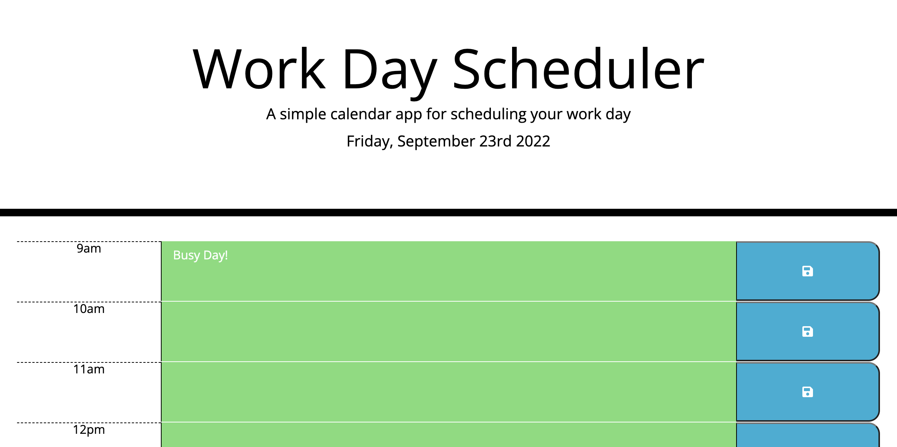

# Work-Day-Scheduler

### **Work Day Scheduler with Text Entry and Local Storage**

[Work Day Scheduler Link](https://jweibelbootcamp.github.io/Work-Day-Scheduler//)

### **Description**
* The is a simple Work Day Scheduler application to demonstrate third party APIs. It automatically displays the current day and date across the header. The text areas allow for user data entry and color code themselves based on current time.  The save button saves each row to local storage. 

### **Technologies Used**
* HTML
* CSS
* JavaScript
* Bootstrap
* jQuery
* Moment.js
* Font Awesome

### **Setup/Installation Instructions**
* Enter text in the central section of the row and press the save button.

### **Known Bugs**
* None 

### **License**
* MIT  
* Copyright (c) 2022 Jason Weibel